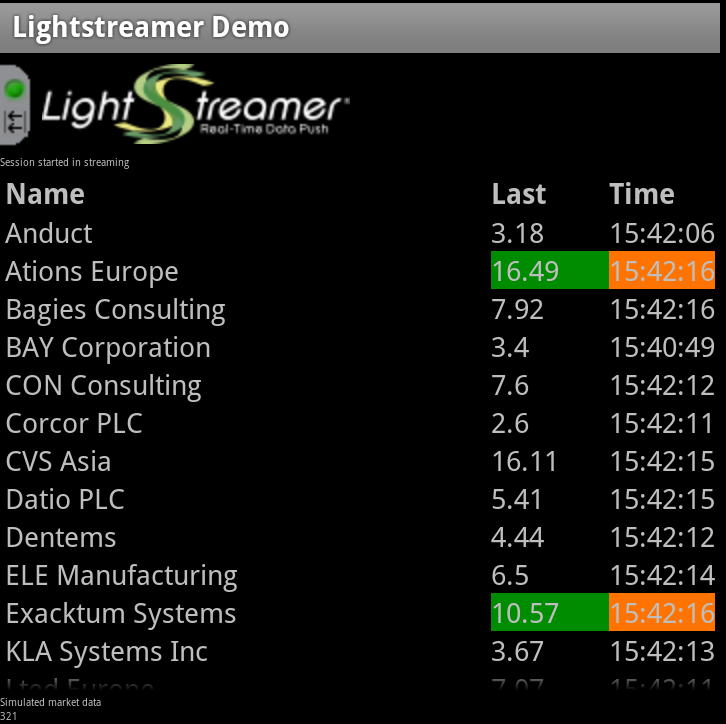

# Lightstreamer StockList Demo Client for BlackBerry Android Runtime #



This demo reuses the sources of the Lightstreamer StockList Demo Client for Android and thus this project has no sources nor resources excluding this README file.

Real-Time simulated Stock-List data is received from the Lightstreamer Server deployed @ [http://push.lightstreamer.com](http://push.lightstreamer.com)

# Build #

There are different ways to compile and convert an Android application to run on BlackBerry 10. This README will focus on the use of the command line tools. Feel free to check the [other possibilities](http://developer.blackberry.com/android/)

*   Download and install the [Command-line tools for Android apps](http://developer.blackberry.com/android/tools/) (scroll down a little to find them)
*   Download and install [VMware Player](http://www.vmware.com/products/player/) for Windows or [VMware Fusion](http://www.vmware.com/products/fusion/overview.html) for Mac.
*   Download and install the [BlackBerry 10 Simulator](https://developer.blackberry.com/devzone/develop/simulator/simulator_installing.html)
*   Download the [Lightstreamer distribution](http://www.lightstreamer.com/download) and copy the Android_StockListDemo_Basic.apk file from the Lightstreamer Android Client SDK (that is located under the DOCS-SDKs/sdk_client_android/examples/Android_StockListDemo/bin folder) into this project.

once ready position the command-line to this project folder.

## Build ##

Being $BB_HOME the folder where you installed the command line tools and $ANDROID_HOME the folder where your Android SDK installation is, run
```
$BB_HOME/bin/apk2bar Android_StockListDemo_Basic.apk $ANDROID_HOME
```
An Android_StockListDemo_Basic.bar file will be generated contained the re-packaged app. You'll also find a Android_StockListDemo_Basic.wrn file containing the conversion log.

## Run ##

Start the BlackBerry 10 Simulator and take note of the IP address (check the bottom-left of the window the simulator is in)

Being $BB_HOME the folder where you installed the command line tools and $IP the IP address of the simulator, run
```
$BB_HOME/bin/blackberry-deploy -installApp $IP Android_StockListDemo_Basic.bar
```
The app icon will appear on the simulator home screen.

# See Also #

*   [Lightstreamer Android Client API reference](http://www.lightstreamer.com/docs/client_android_api/index.html)

## Lightstreamer Adapters needed by this demo client ##

*   [Lightstreamer StockList Demo Adapter](https://github.com/Weswit/Lightstreamer-example-Stocklist-adapter-java)
*   [Lightstreamer Reusable Metadata Adapter in Java](https://github.com/Weswit/Lightstreamer-example-ReusableMetadata-adapter-java)


# Lightstreamer Compatibility Notes #

*   Compatible with Lightstreamer Android Client library version 2.1 or newer.
*   For Lightstreamer Allegro (+ Android Client API support), Presto, Vivace.